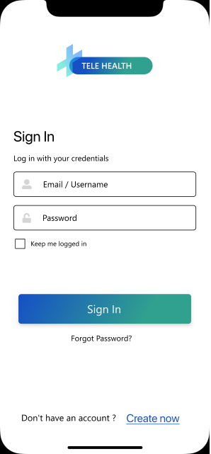
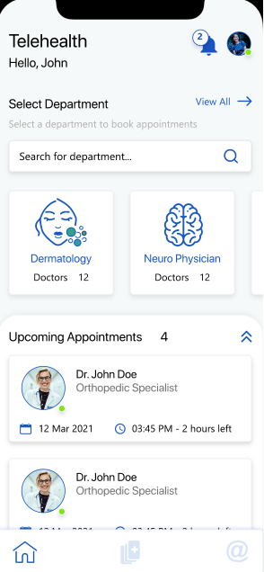
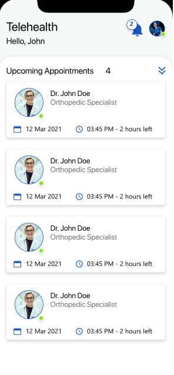
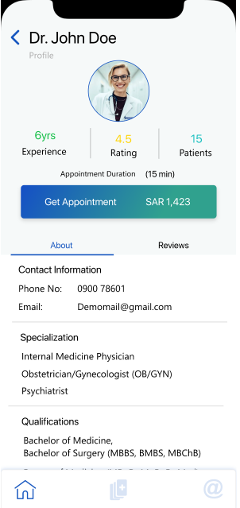
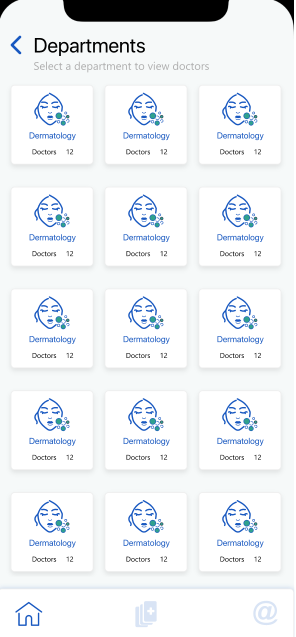
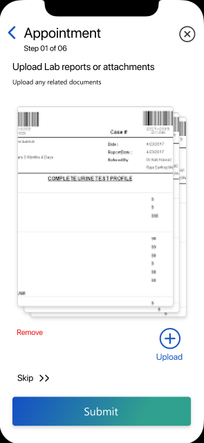
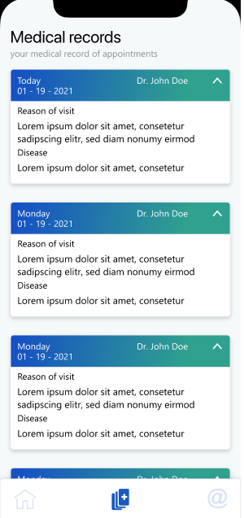
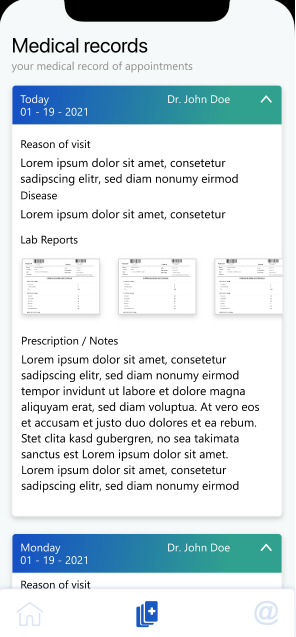
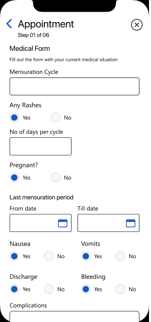
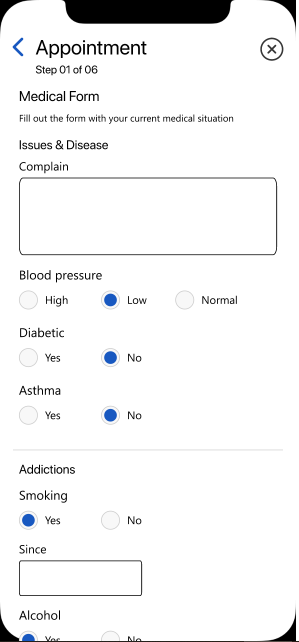

# Telehealth

INTRODUCTION

Telehealth is a web portal that allows the Saudi patients to get registered with the doctors reside in abroad. They can consult with the doctors online and pay their consultancy fee accordingly. It is developed to provide ease to the people who want to consult the foreigner doctors without actually going there. Mobile application is also developed in Flutter.

KEY FEATURES:

1. Search & Select Doctor
2. Book an Appointment
3. Receive Notification 
4. Consult with Doctor
5. Select Payment Method
6. Share Timeslot
7. Approve Appointment
8. Communicate with Patient
9. Payment Management 
10. Prescription

TECHNOLOGIES & TOOLS USED

SCREENSHOTS

           
